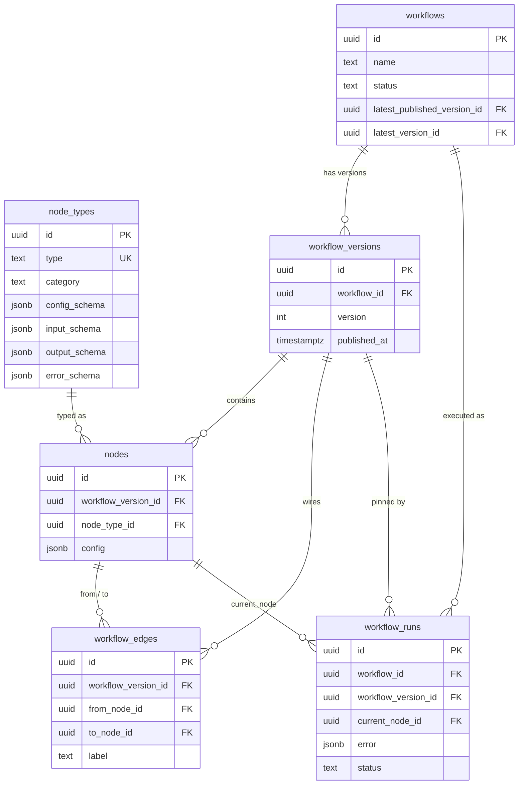

# Orchex

## Design diagrams (Excalidraw)

GitHub Markdown does **not** render raw `.excalidraw` JSON inline (unlike Mermaid). Keep the editable board in-repo and open it in [excalidraw.com](https://excalidraw.com) (☰ → Open) or a VS Code / Cursor Excalidraw extension.

| Board | File |
| ----- | ---- |
| Interview requirements + design notes | [`orchex.excalidraw`](./orchex.excalidraw) |

Schema ER overview (renders on GitHub):

Related artifacts:

- [`schema.dbml`](./schema.dbml) — Postgres OLTP schema
- [`node-type-schemas/`](./node-type-schemas/) — per-type config / input / output / error JSON Schemas

## Functional Requirements

### 1) Workflow Triggering

**Candidate:** How should the workflow be triggered: webhooks, scheduler, or manual?  
**Interviewer:** Let's start with manual, but it should be extensible.

### 2) Node Support

**Candidate:** What kind of nodes do we need to support: Triggers, Integration Actions, General API Node, Conditional Nodes, Agent Node, Function Node, Scheduler, Response, Router?  
**Interviewer:** At a minimum, we will support:

- General API Node
- Conditional Node
- Function Node
- Integration Action Node
- Response Node

### 3) Graph and Connection Rules

**Candidate:** We have nodes and edges; how should nodes connect? Is it directed? Can there be cycles? Can we have branching and concurrency? What in-degree / out-degree should each node type allow?  
**Interviewer:** We will use a directed graph (`from -> to`), and cycles are disallowed (DAG).

| Node Type               | In-degree | Out-degree |
| ----------------------- | --------- | ---------- |
| Response Node           | 1         | 0          |
| Start Node              | 0         | 1          |
| Conditional Node        | 1         | 2          |
| Function Node           | 1         | 1          |
| General API Node        | 1         | 1          |
| Integration Action Node | 1         | 1          |

### 4) Error Handling

**Candidate:** Should we handle failures gracefully? For example: corrupted incoming data at Conditional Node, function execution failures, integration/API responses outside `2xx` (token expiry, timeout).  
**Interviewer:** Yes, we must handle these errors gracefully.

### 5) Failure Recovery Strategy

**Candidate:** Do we need atomic workflow execution (full rollback on failure and mark as `FAILED`), or should we support resume-from-failure?  
**Interviewer:** For simplicity, start with resume-from-failure. We can discuss atomic execution later if time permits.

### 6) Observability Scope

**Candidate:** Do we need node-level traces and workflow-level logs for each run?  
**Interviewer:** Store workflow-level logs first; we can add node-level traces later if time permits.

### 7) Scale Assumptions

**Candidate:** How many runs per day and how many total user workflows are expected?  
**Interviewer:** `1M` runs/day and `100K` combined workflows.

### 8) Integration Infrastructure

**Candidate:** Should we build integrations and credentials, or assume they already exist?  
**Interviewer:** Assume integration infrastructure and auth are already in place. We will use Composio.

## Non-Functional Requirements

### Reliability

- The system should support restarting workflow execution from the point of failure.

### Scalability

- Assumption: `100K` workflows and `1M` runs/day.
- Approximation: ~`10` new workflow starts/second on average.
- Target ingest QPS for new workflow runs:
  - Baseline: `10 QPS`
  - Peak: `100 QPS` (`10x` burst)
- Throughput expectation:
  - `600` workflows/minute if average run time is ~1 minute
  - System should handle at least `600` concurrent workflows
  - During peak, target up to `60K` concurrent workflows
- Design must account for disk I/O, concurrency control, and reliability under high throughput.

### Data Characteristics (Write Heavy)

- The system is write-heavy due to:
  - frequent state-transition logging
  - node execution traces
  - historical and analytics data
- Despite write-heavy behavior, entity relationships remain important.
- Storage strategy:
  - `Postgres` for OLTP
  - `ClickHouse` for OLAP

### Consistency Model

- Eventual consistency is acceptable.
- Millisecond-level delays in traces and logs are acceptable.
