<div align="center">

# Orchex

**A durable workflow builder designed one decision at a time**

Build a graph. Publish an immutable version. Run it reliably. Resume exactly where it failed.

</div>

---

Orchex is a workflow builder. A user draws a flow, publishes it, and asks us to run it reliably.

That sounds simple until the first practical questions arrive. What happens while a user is halfway through drawing an invalid graph? Which version should a run use if the workflow is edited while it is running? If one API call fails after three successful steps, do we start everything again? And how do we keep this understandable when the system grows from a handful of runs to a million a day?

This document tells the story of the design as a conversation between an interviewer and a candidate. It is intentionally separated into functional requirements, non-functional requirements, high-level design, API design, schema design, and the deep dives we will add later.

> [!IMPORTANT]
> [`orchex.excalidraw`](./orchex.excalidraw) is the source of truth for architecture, API, schema, the execution deep dive, the queue-product decision, the OLTP/RDS decision, and the graph data-structure board. [`orchex-control-plane-compute.excalidraw`](./orchex-control-plane-compute.excalidraw) holds the control-plane compute decision. [`schema.dbml`](./schema.dbml) defines the PostgreSQL model, [`bench/postgres`](./bench/postgres) holds the OLTP capacity harness behind the RDS decision, [`node-type-schemas`](./node-type-schemas) contains the executable node contracts, and [`data-structure`](./data-structure) contains the graph experiments that informed the design.

### At a glance

| Concern      | v1 decision                                                         |
| ------------ | ------------------------------------------------------------------- |
| Product      | Orchex owns workflow orchestration                                  |
| Graph        | Directed acyclic graph with typed degree rules                      |
| Trigger      | Manual first; webhook and scheduler later                           |
| Recovery     | Checkpoint, auto-retry transient errors, then retry the failed node |
| Definitions  | Mutable draft, immutable published version                          |
| Execution    | Outbox + relay → SQS → workers; DLQ after 5 deliveries              |
| Storage      | Amazon RDS for PostgreSQL (OLTP); ClickHouse planned for OLAP       |
| Compute      | Amazon ECS on Fargate (APIs, relay, workers)                        |
| Scale target | 1M runs/day and 100 QPS burst ingestion                             |

### Contents

- [1. Functional Requirements](#1-functional-requirements)
- [2. Non-Functional Requirements](#2-non-functional-requirements)
- [3. High-Level Design](#3-high-level-design)
- [4. API Design](#4-api-design)
- [5. Schema Design](#5-schema-design)
- [6. Deep-Dive Design: Execution](#6-deep-dive-design-execution)
- [7. Deep-Dive Design: OLTP Database](#7-deep-dive-design-oltp-database)
- [8. Deep-Dive Design: Graph Data Structure](#8-deep-dive-design-graph-data-structure)
- [9. Deep-Dive Design: Control Plane Compute](#9-deep-dive-design-control-plane-compute)
- [10. Deep Dives Still To Come](#10-deep-dives-still-to-come)

## 1. Functional Requirements

### What are we building?

**Interviewer:** What is Orchex, and where do we draw the product boundary?

**Candidate:** We are building a workflow product, not a thin UI over somebody else's orchestrator. Orchex therefore owns:

- workflow definitions and versioning;
- graph validation;
- scheduling one node at a time;
- checkpoints and run state;
- pause, resume, stop, and retry behavior;
- the contract between each node and the next one.

### How is a workflow triggered?

**Interviewer:** Should a workflow start through a webhook, a schedule, or a manual action?

**Candidate:** For v1, a workflow starts manually. Webhooks and schedules are represented in the underlying trigger model so we can add them later, but they are not exposed by the current API.

### How do integrations work?

**Interviewer:** Are we also building the integration catalog and credential system?

**Candidate:** No. We assume integration infrastructure and authentication already exist, and use Composio for Integration Action nodes. Orchex decides when an action executes and how its result moves through the graph; Composio handles the provider-specific action and credentials.

### What does a workflow look like?

**Interviewer:** We have nodes and edges, but what rules turn that graph into a valid workflow?

**Candidate:** The builder stores nodes and directed edges. An edge `A -> B` means that B may run after A. The graph must be a DAG: directed, with no cycles.

We deliberately validate in two stages:

1. **Save is forgiving.** A draft is work in progress. It may be disconnected or incomplete while somebody is drawing it.
2. **Publish is strict.** A published workflow must be non-empty, acyclic, and satisfy the degree rules for every node type.

This separation matters. If every save required a runnable graph, the builder would fight the user. If publish accepted an unfinished graph, the execution engine would inherit a problem it cannot safely solve.

### Which nodes do we support?

**Interviewer:** Which node types are in v1, and how may they connect?

**Candidate:** We support six node types:

| Node                   | Role                              | In  | Out |
| ---------------------- | --------------------------------- | :-: | :-: |
| **Start**              | Entry point                       | `0` | `1` |
| **Conditional**        | Choose a `true` or `false` branch | `1` | `2` |
| **Function**           | Run isolated JavaScript           | `1` | `1` |
| **General API**        | Make an HTTP request              | `1` | `1` |
| **Integration Action** | Invoke a Composio action          | `1` | `1` |
| **Response**           | Finish the workflow               | `1` | `0` |

Normal edges use the label `default`. The two outgoing edges of a Conditional use `true` and `false`. The database enforces one edge per `(workflow version, source node, label)`, which also prevents two `true` branches from the same Conditional.

Those degree rules also mean v1 has no merge points. After a Conditional branches, each path continues independently; nothing may rejoin with fan-in greater than one. That keeps scheduling and resume simple for now. Join semantics can come later with an explicit node type rather than as a silent graph exception.

Agent, Router, and Scheduler nodes are intentionally deferred. The schema-driven node catalog lets us add them without changing the identity model.

### Why a DAG

**Interviewer:** Why disallow cycles instead of supporting loops immediately?

**Candidate:** A DAG gives us a finite execution path and a valid topological order. More importantly, it keeps v1 recovery understandable: a worker executes a node, stores a checkpoint, and schedules the next node. A cycle would turn that into loop semantics—iteration limits, repeated state, and more complicated retry rules—which is a separate feature rather than a small extension.

How we represent that graph in memory, check degrees, detect cycles, and derive an execution order is covered in the [graph data-structure deep dive](#8-deep-dive-design-graph-data-structure). The Go sketches in [`data-structure`](./data-structure) are the learning notes behind that board. Reachability from Start is a useful check there, but it is not yet part of the published hard-validation checklist.

### How does draft and publish work?

**Interviewer:** What happens when someone edits a workflow that is already live?

**Candidate:** The most important versioning decision is that “what I am editing” and “what is live” are not always the same thing.

Creating a workflow atomically creates the workflow and an empty draft version 1. While that version is a draft, saves update it in place. Once published, it becomes immutable.

If a user edits again after publishing, the next full `PUT` becomes a new draft version. We do not deep-copy the published graph and then apply a patch: the client already sends the complete graph, so that request is the new snapshot.

Two pointers on `workflows` make this explicit:

- `latest_version_id` points to the editable head;
- `latest_published_version_id` points to the version used by new runs.

Before the first publish, the published pointer is `null`. When there are no unpublished changes, both pointers are equal. When they differ, the builder can show “unpublished changes” without comparing two graphs.

The workflow status describes its wider lifecycle:

- `draft`: it has never been published;
- `published`: it has been published at least once, even if a newer draft now exists;
- `archived`: it has been soft-deleted.

Archiving removes a workflow from normal retrieval and prevents future edits or publishes. There is no unarchive API in v1. Existing runs are different: each run is pinned to a published version, so publishing something newer or archiving the workflow does not rewrite history underneath it.

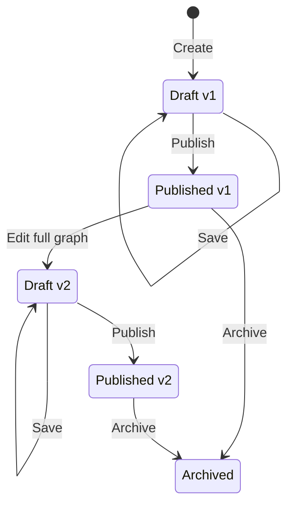

### How do failures recover?

**Interviewer:** If the fourth node fails after three successful nodes, do we roll back everything?

**Candidate:** No. External actions cannot always be reversed, so full transactional rollback would promise something we cannot reliably deliver. We checkpoint the current node, keep the structured error, and retry that same node in the same run. Atomic whole-workflow rollback is deferred.

### How are node failures presented?

**Interviewer:** What happens when a Conditional receives bad data, a Function throws, an integration token expires, or an API times out or returns non-2xx?

**Candidate:** Every executor fails through a structured node-specific error envelope. It gives the UI a stable error class, code, user-facing message, retryability, and optional remediation details. The run stores that error together with the failing node ID so recovery is explicit rather than hidden in logs.

### What execution controls do users need?

**Interviewer:** Can a running workflow be controlled?

**Candidate:** Yes. A run can be paused, resumed, stopped, or retried, subject to its current state. Pause is soft: an in-flight node finishes, but its successor is not scheduled. Stop moves the run to terminal `cancelled`. Retry is only for `failed` runs and continues from `current_node_id`.

### What do we expose for observability?

**Interviewer:** Do we need full node-level traces from day one?

**Candidate:** We start with workflow-level run state and logs. Detailed node-level traces and long-term analytics come later through ClickHouse. This keeps the operational path small while preserving a clear place to add deeper observability.

## 2. Non-Functional Requirements

### Reliability

**Interviewer:** What reliability guarantee matters most in v1?

**Candidate:** A failed run must be restartable from its checkpoint without replaying successful nodes. Runs are pinned to an immutable published version so later edits cannot change an execution already in progress.

Checkpointing and enqueueing the next node are made atomic through a transactional outbox — settled in the [execution deep dive](#6-deep-dive-design-execution). The durable intermediate run-context shape still needs to be finalized before resume is production-ready.

### Scale

**Interviewer:** What scale are we designing for?

**Candidate:** The initial assumptions are:

- 100,000 workflows;
- 1 million runs per day;
- roughly 10 new runs per second on average;
- 100 QPS during a 10x start burst;
- about 600 concurrent runs if baseline runs last one minute;
- about 6,000 concurrent at the 100 QPS peak if runs still average one minute;
- a capacity target of about 60,000 concurrent runs when nodes run longer (not from the one-minute calculation).

### Data and consistency

**Interviewer:** This sounds write-heavy. Where does the data go, and do all reads need immediate consistency?

**Candidate:** PostgreSQL on Amazon RDS is the OLTP source of truth for definitions, immutable published snapshots, checkpoints, and current run state — why that product, and why not the other common options, is settled in the [OLTP database deep dive](#7-deep-dive-design-oltp-database). ClickHouse is the planned OLAP store for historical logs, node traces, and analytics.

Execution checkpoints need strong correctness. Observability can be eventually consistent; a few milliseconds before a trace appears is acceptable.

### Security and isolation

**Interviewer:** Users can write Function nodes. Do those run inside our workers?

**Candidate:** No. Untrusted JavaScript runs in an isolated Lambda/E2B-like sandbox. The worker owns orchestration, while the sandbox only executes code. In short: rent isolation, not the brain.

### Extensibility

**Interviewer:** Are we locking the system to these six nodes and manual triggers?

**Candidate:** No. Node behavior is schema-driven, and the trigger enum already leaves room for webhooks and schedules. We are keeping the v1 surface small without baking those limitations into the core model.

## 3. High-Level Design

### Which architecture did we choose?

**Interviewer:** Why not use SWF, Step Functions, or Temporal for the whole system?

**Candidate:** They solve overlapping problems for different products.

- **Amazon SWF** is AWS’s older fully-managed state tracker: it stores execution history and coordinates decision/activity tasks, while your workers still run the real work. Fine for legacy or custom-worker setups; for new AWS-native work it is largely superseded by Step Functions.
- **Step Functions** fits an AWS-native internal tool — you define a state machine and AWS runs and persists it.
- **Temporal** fits an internal system that wants a mature durable-execution engine (history, replay, activities) without building that layer from scratch.

Orchex is itself a workflow-builder product, so it needs to own DAG progression, branching, checkpoints, retries, and the builder semantics. We take the queues-and-workers path, and use sandboxes like Durable Lambda only for isolating untrusted function code — not as the orchestrator.

The selected design is a queue-and-worker control plane, with isolated execution only where a node requires it. Where that control plane runs — **ECS on Fargate** — is settled in the [control plane compute deep dive](#9-deep-dive-design-control-plane-compute).

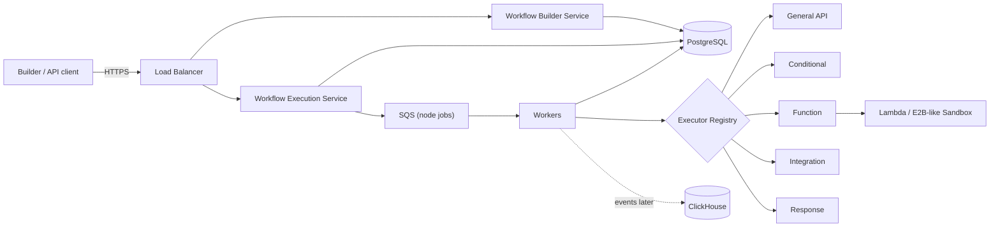

### How does one node execute?

**Interviewer:** Walk me through a run.

**Candidate:**

1. Starting a run pins a published version, stores the Start checkpoint, and enqueues a node job.
2. A worker receives the job and loads the run plus its pinned graph.
3. It selects the executor for the node type.
4. The executor validates its input and performs one unit of work.
5. On success, the worker checkpoints progress and enqueues the selected successor.
6. On failure, it stores a structured error and leaves `current_node_id` at the node that must be retried.

Queue jobs carry identity—primarily `run_id` and `node_id`—instead of becoming a second database. PostgreSQL remains the source of operational truth.

### How are definition and execution traffic separated?

**Interviewer:** Do workflow editing and workflow execution go through the same service?

**Candidate:** They share the public load balancer but split by intent. The distributed Workflow Builder service handles create, retrieve, update, publish, and archive. The distributed Workflow Execution service handles start, retrieve run, pause, resume, stop, and retry. Each side can scale independently.

## 4. API Design

**Interviewer:** What conventions apply to the whole API?

**Candidate:** All routes use the `/v1` prefix. Authentication is assumed to be handled by middleware and is not part of these payloads.

The API uses optimistic concurrency for workflow editing. Timestamps are UTC ISO-8601 strings. IDs are UUIDs in storage; readable IDs below are examples only.

### Endpoint index

| Method   | Path                              | Purpose                              | Success |
| -------- | --------------------------------- | ------------------------------------ | :-----: |
| `POST`   | `/v1/workflows`                   | Create workflow and empty draft v1   |  `201`  |
| `GET`    | `/v1/workflows`                   | List non-archived workflow summaries |  `200`  |
| `GET`    | `/v1/workflows/:id`               | Retrieve latest or published graph   |  `200`  |
| `PUT`    | `/v1/workflows/:id`               | Replace the editable graph           |  `200`  |
| `POST`   | `/v1/workflows/:id/publish`       | Validate and publish the head        |  `200`  |
| `DELETE` | `/v1/workflows/:id`               | Archive a workflow                   |  `204`  |
| `POST`   | `/v1/workflows/:workflow_id/runs` | Start a run                          |  `201`  |
| `GET`    | `/v1/runs/:run_id`                | Retrieve a run snapshot              |  `200`  |
| `POST`   | `/v1/runs/:run_id/pause`          | Soft-pause a run                     |  `200`  |
| `POST`   | `/v1/runs/:run_id/resume`         | Resume a paused run                  |  `200`  |
| `POST`   | `/v1/runs/:run_id/stop`           | Cancel a run                         |  `200`  |
| `POST`   | `/v1/runs/:run_id/retry`          | Retry the failed node                |  `200`  |

### Shared shapes

**Interviewer:** Which objects appear repeatedly in the API?

**Candidate:** The API is built around a Workflow, a versioned graph, and a Run.

#### Workflow

<details>
<summary><strong>Example Workflow JSON</strong></summary>

```json
{
  "id": "wf_01",
  "name": "Onboarding",
  "description": "User signup flow",
  "status": "published",
  "latest_version_id": "ver_02",
  "latest_published_version_id": "ver_01",
  "created_at": "2026-07-15T08:00:00Z",
  "updated_at": "2026-07-15T09:30:00Z",
  "last_published_at": "2026-07-15T09:00:00Z"
}
```

</details>

`description`, `latest_published_version_id`, and `last_published_at` may be `null` when they do not apply.

#### Version graph

<details>
<summary><strong>Example VersionGraph JSON</strong></summary>

```json
{
  "id": "ver_02",
  "version": 2,
  "published_at": null,
  "nodes": [
    {
      "id": "node_start",
      "node_type": "start",
      "name": "Start",
      "config": {},
      "position": { "x": 40, "y": 80 }
    }
  ],
  "edges": [
    {
      "id": "edge_1",
      "from_node_id": "node_start",
      "to_node_id": "node_api",
      "label": "default"
    }
  ]
}
```

</details>

Node and edge IDs are generated by the client. They remain stable when a graph is forked into a new version. `position` belongs to the builder layout; it has no execution meaning.

#### Run

<details>
<summary><strong>Example Run JSON</strong></summary>

```json
{
  "id": "run_01",
  "workflow_id": "wf_01",
  "workflow_version_id": "ver_01",
  "status": "running",
  "trigger_type": "manual",
  "current_node_id": "node_api",
  "error": null,
  "started_at": "2026-07-17T08:00:01Z",
  "paused_at": null,
  "cancelled_at": null,
  "completed_at": null,
  "failed_at": null,
  "created_at": "2026-07-17T08:00:00Z",
  "updated_at": "2026-07-17T08:00:01Z"
}
```

</details>

Run status is one of `pending`, `running`, `paused`, `failed`, `completed`, or `cancelled`.

### Workflow endpoints

#### Create

**Interviewer:** How do we create a workflow?

**Candidate:** Creation accepts only workflow metadata. It creates the workflow row and an empty draft v1 atomically.

```http
POST /v1/workflows
```

`description` is optional, and the request does not accept a graph. The response is `201 Created` with the Workflow fields plus an empty `graph`. The workflow row and v1 are created in one transaction; validation failures return `400`.

<details>
<summary><strong>Example request and response</strong></summary>

**Request**

```json
{
  "name": "Onboarding",
  "description": "User signup flow"
}
```

**Response addition**

```json
{
  "graph": {
    "id": "ver_01",
    "version": 1,
    "published_at": null,
    "nodes": [],
    "edges": []
  }
}
```

</details>

#### List

**Interviewer:** Does the list endpoint return every graph?

**Candidate:** No. It returns lightweight, non-archived summaries so the workflow list does not load complete node and edge snapshots.

```http
GET /v1/workflows
```

The response is `200 OK`:

<details>
<summary><strong>Example response</strong></summary>

```json
{
  "items": [
    {
      "id": "wf_01",
      "name": "Onboarding",
      "description": "User signup flow",
      "status": "published",
      "latest_version_id": "ver_02",
      "latest_published_version_id": "ver_01",
      "created_at": "...",
      "updated_at": "...",
      "last_published_at": "...",
      "has_unpublished_changes": true
    }
  ]
}
```

</details>

Archived workflows are excluded. This is a summary endpoint, so it does not return nodes or edges. Pagination, filtering, and ordering are not part of the current contract.

#### Retrieve

**Interviewer:** How does the client ask for the editable graph versus the live graph?

**Candidate:** It selects `latest` or `published`; `latest` is the default.

```http
GET /v1/workflows/:id
GET /v1/workflows/:id?version=latest
GET /v1/workflows/:id?version=published
```

`latest` is the default and returns the editable head. `published` returns the live graph. The response is `200 OK` and combines the Workflow and Version graph shapes under a `graph` field.

Requesting `published` before the first publish returns `404`. Archived workflows are unavailable; the current design reserves `404`/`410` for missing or archived resources. Retrieval by an arbitrary version ID is deferred.

#### Update

**Interviewer:** Do we patch individual graph operations?

**Candidate:** No. Like n8n-style editors, the client sends the complete graph as the new truth. Optimistic concurrency prevents one editor from silently overwriting another.

```http
PUT /v1/workflows/:id
```

This is a complete replacement, not a patch:

<details>
<summary><strong>Example full-graph request</strong></summary>

```json
{
  "expected_latest_version_id": "ver_01",
  "name": "Onboarding",
  "description": "User signup flow",
  "nodes": [
    {
      "id": "node_start",
      "node_type": "start",
      "name": "Start",
      "config": {},
      "position": { "x": 40, "y": 80 }
    },
    {
      "id": "node_api",
      "node_type": "api",
      "name": "Create user",
      "config": {
        "method": "POST",
        "url": "https://example.com/users"
      },
      "position": { "x": 280, "y": 80 }
    }
  ],
  "edges": [
    {
      "id": "edge_1",
      "from_node_id": "node_start",
      "to_node_id": "node_api",
      "label": "default"
    }
  ]
}
```

</details>

Saving performs soft validation:

- every `node_type` is known;
- every `config` matches that node type's config schema;
- every edge endpoint exists in the submitted graph;
- node and edge IDs are unique within the version;
- node `name` values are unique within the version;
- `expected_latest_version_id` still matches the server's editable head.

An incomplete graph is allowed here. Same-version edge integrity is also enforced by composite foreign keys in Postgres when the graph is persisted.

If the head is a draft, the server updates it in place. If the head is already published, the submitted graph becomes a new draft version. The response is `200 OK`:

<details>
<summary><strong>Example saved-head response</strong></summary>

```json
{
  "id": "wf_01",
  "status": "published",
  "latest_version_id": "ver_02",
  "latest_published_version_id": "ver_01",
  "graph": {
    "id": "ver_02",
    "version": 2,
    "published_at": null,
    "nodes": [
      {
        "id": "node_start",
        "node_type": "start",
        "name": "Start",
        "config": {},
        "position": { "x": 40, "y": 80 }
      },
      {
        "id": "node_api",
        "node_type": "api",
        "name": "Create user",
        "config": {
          "method": "POST",
          "url": "https://example.com/users"
        },
        "position": { "x": 280, "y": 80 }
      }
    ],
    "edges": [
      {
        "id": "edge_1",
        "from_node_id": "node_start",
        "to_node_id": "node_api",
        "label": "default"
      }
    ]
  },
  "id_remaps": []
}
```

</details>

`graph` is the complete saved head. `id_remaps` reports the rare case where a client ID collides inside the target version and the server has to replace it. The element shape of each remap is not fully specified yet; treat the field as a reserved collision report until we lock the object fields.

Validation failures return `400`, missing or archived workflows return `404`/`410`, and a stale expected version returns `409 Conflict`.

#### Publish

**Interviewer:** What changes when a draft is published?

**Candidate:** The editable head is hard-validated, marked immutable, and becomes the version used by new runs.

```http
POST /v1/workflows/:id/publish
```

Request body: `{}`.

Publish performs hard validation:

- the graph is not empty;
- it is a DAG (no cycles);
- node degrees match their node types.

Config validity, edge endpoints, and unique IDs remain soft-validation concerns from Update. Same-version edge and checkpoint integrity come from the database foreign keys. Reachability from Start and “exactly one Start” are not yet on the hard-validation checklist.

The response is `200 OK`:

<details>
<summary><strong>Example publish response</strong></summary>

```json
{
  "id": "wf_01",
  "name": "Onboarding",
  "status": "published",
  "latest_version_id": "ver_02",
  "latest_published_version_id": "ver_02",
  "last_published_at": "2026-07-15T09:00:00Z",
  "published_version": {
    "id": "ver_02",
    "version": 2,
    "published_at": "2026-07-15T09:00:00Z"
  }
}
```

</details>

The response is intentionally thin; the client already has the graph it published. Publishing a head that is already live is an idempotent `200` no-op. Validation failures return `400`; missing or archived workflows return `404`/`410`.

#### Archive

**Interviewer:** Is delete destructive?

**Candidate:** No. It is a soft archive. The definition becomes unavailable for normal workflow operations, while existing pinned runs may continue.

```http
DELETE /v1/workflows/:id
```

The response is `204 No Content`. This is a soft delete: status becomes `archived`, the workflow disappears from list results, and it can no longer be edited or published. Existing pinned runs may continue. No unarchive endpoint exists in v1.

### Run endpoints

#### Start a run

**Interviewer:** How does execution begin?

**Candidate:** Start pins the latest published version and creates a `pending` run at that version's Start node. The execution contract expects a usable Start node; enforcing exactly one Start during publish remains an explicitly tracked validation gap.

```http
POST /v1/workflows/:workflow_id/runs
```

Request body: `{}`. Runtime input is deliberately deferred in v1.

The server pins the workflow's `latest_published_version_id`, finds that version's Start node, stores it as `current_node_id`, and returns `201 Created` with a complete Run in `pending`.

A workflow that is missing, archived, still a draft, or has never been published returns `404`. Concurrent runs are allowed. Start-run idempotency is not defined yet.

#### Retrieve a run

**Interviewer:** Can terminal runs still be inspected?

**Candidate:** Yes. Retrieve always returns the complete snapshot, including completed, failed, and cancelled runs.

```http
GET /v1/runs/:run_id
```

The response is `200 OK` with the complete Run snapshot. Runs remain readable in every state, including `completed`, `failed`, and `cancelled`. An unknown run returns `404`.

#### Pause

**Interviewer:** What does pause mean if a node is already running?

**Candidate:** It is a soft pause: finish the in-flight node, checkpoint it, and do not schedule the successor.

```http
POST /v1/runs/:run_id/pause
```

Request body: `{}`.

Pause is soft. If a worker is already executing a node, it finishes that node and checkpoints it, but does not enqueue the successor.

- `pending` or `running` becomes `paused`;
- already `paused` is an idempotent `200`;
- `completed`, `failed`, or `cancelled` returns `409`.

The `200 OK` response is the complete updated Run with `paused_at` set.

#### Resume

**Interviewer:** Where does a paused run continue?

**Candidate:** It continues in the same run from `current_node_id`.

```http
POST /v1/runs/:run_id/resume
```

Request body: `{}`.

- `paused` becomes `running` and continues from `current_node_id`;
- already `running` is an idempotent `200`;
- every other state returns `409`.

A failed run uses Retry, not Resume.

#### Stop

**Interviewer:** Can a stopped run be resumed later?

**Candidate:** No. Stop produces terminal `cancelled`. It is intentionally different from Pause.

```http
POST /v1/runs/:run_id/stop
```

Request body: `{}`.

- `pending`, `running`, or `paused` becomes `cancelled`;
- already `cancelled` is an idempotent `200`;
- `completed` or `failed` returns `409`.

The response is the updated Run with `cancelled_at` set. Cancelled is terminal: it cannot be resumed or retried. Stop remains available even if the parent workflow has since been archived.

#### Retry

**Interviewer:** Does retry create a new run or replay the graph?

**Candidate:** Neither. It clears the failure and re-executes the checkpointed node in the same run.

```http
POST /v1/runs/:run_id/retry
```

Request body: `{}`.

- `failed` becomes `running`;
- already `running` is an idempotent `200`;
- every other state returns `409`.

Retry clears `error` and re-executes `current_node_id` in the same run. We do not create a second run and we do not replay successful nodes.

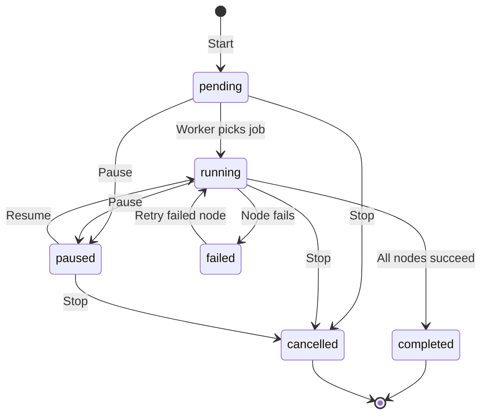

### Worker-driven transitions

**Interviewer:** Which state changes happen without an API call?

**Candidate:** Workers make normal execution progress:

- `pending -> running` when a worker accepts the first job;
- `running -> completed` after the terminal node succeeds;
- `running -> failed` when a node error is checkpointed.

`completed` and `cancelled` are terminal. `failed` stays frozen until Retry.

### HTTP errors still to standardize

**Interviewer:** Is the HTTP error contract final?

**Candidate:** Not completely. The design fixes status meanings but does not yet define a shared HTTP error JSON body. It also leaves the final choice between `404` and `410` for archived workflows open. Those are API-contract tasks, not details an implementation should invent independently.

## 5. Schema Design

### Why PostgreSQL and relational tables?

**Interviewer:** A workflow is a graph, so why not put everything in one JSON document or a graph database?

**Candidate:** The graph shape is important, but so are relational guarantees. A run must point to a real published version, an edge must not cross versions, and a checkpoint must belong to the exact graph the run pinned. PostgreSQL gives us those constraints while JSONB handles type-specific node configuration. Which Postgres _product_ we run (RDS vs Aurora vs the rest of the market) is decided in the [OLTP database deep dive](#7-deep-dive-design-oltp-database).

> [!NOTE]
> This section covers the baseline tables. Later deep dives extend the schema as decisions are made — the [execution deep dive](#6-deep-dive-design-execution) already adds an outbox table, a retry counter, and their integrity constraints, explained [with examples there](#what-this-deep-dive-changed-in-the-schema).

### How are node contracts represented?

**Interviewer:** Different node types accept different configuration and runtime data. Do we hard-code every shape in each service?

**Candidate:** No. Every node type owns four JSON Schema 2020-12 documents:

- `config_schema`: what the builder stores for the node;
- `input_schema`: what the executor accepts from upstream;
- `output_schema`: what it passes downstream;
- `error_schema`: how failure is reported.

The schemas live in [`node-type-schemas`](./node-type-schemas) and are seeded into `node_types`. This keeps validation shared between the builder, API, and workers instead of scattering type-specific assumptions through each service.

For every node except Start input, runtime payloads use a top-level `data` field. Start accepts an empty input object with no properties; its output still uses `data.payload`.

**Interviewer:** What does each v1 node contract require?

**Candidate:** Each node keeps its own strict configuration, input, output, and error vocabulary.

### Start

**Interviewer:** What begins the runtime data flow?

**Candidate:** Start has no upstream runtime input and produces the trigger payload.

- Config: optional `description` of 1–512 characters.
- Input: empty object (`additionalProperties: false`, no `data` field).
- Output: `data.payload`, which may be an object, array, string, number, boolean, or `null`.
- Error `type`: `validation | internal`.
- Errors: `INVALID_TRIGGER_PAYLOAD`, `INTERNAL_ERROR`.

### Conditional

**Interviewer:** How is a branch selected?

**Candidate:** Conditional evaluates a boolean expression and annotates the outgoing data with the selected branch.

- Config: required `expression` over `input.data`, up to 4096 characters.
- Input: open object under `data`.
- Output: open object under `data` that includes `data.branch` as `"true"` or `"false"`, while other upstream fields may pass through.
- Error `type`: `validation | operation | internal`.
- Errors: `INVALID_INPUT`, `EXPRESSION_ERROR`, `INTERNAL_ERROR`.

### Function

**Interviewer:** How do we support custom logic without making its output rigid?

**Candidate:** Function executes JavaScript in isolation and may return any JSON value.

- Config: `runtime` is fixed to `js`; `source` is required and may be up to 65,536 characters.
- Timeout: 5 seconds by default, from 1 ms to 300 seconds.
- Input: open object under `data`.
- Output: any JSON value under `data`.
- Error `type`: `validation | operation | timeout | internal`.
- Errors: `INVALID_INPUT`, `RUNTIME_ERROR`, `TIMEOUT`, `INTERNAL_ERROR`.

### General API

**Interviewer:** What does the generic HTTP node need to describe?

**Candidate:** It captures the request template and returns the upstream HTTP response through the common data envelope.

- Config: required `method` and URI-template `url`.
- Methods: `GET`, `POST`, `PUT`, `PATCH`, `DELETE`, `QUERY`.
- Optional config: headers, query parameters, body template, and timeout.
- Timeout: 30 seconds by default, up to 300 seconds.
- Input: open object under `data`.
- Successful output: `data.status`, `data.headers`, and `data.body`.
- A non-2xx HTTP response becomes an execution error with code `HTTP_NON_2XX` and does not hand off as success to the next node. The output schema still enumerates a broad status set for the successful response shape; the error envelope owns the failure path.
- Error `type`: `validation | api | timeout | rate_limit | internal`.
- Errors: `INVALID_INPUT`, `INVALID_CONFIG`, `HTTP_NON_2XX`, `TIMEOUT`, `NETWORK_ERROR`, `RATE_LIMITED`, `INTERNAL_ERROR`.

### Integration Action

**Interviewer:** How does a provider-specific action fit the same graph model?

**Candidate:** The node delegates the action to Composio but keeps Orchex's normal input, output, timeout, and error contracts.

- Provider: fixed to `composio`.
- Config: uppercase action ID such as `GITHUB_CREATE_ISSUE`, optional templated parameters, and timeout.
- Timeout: 30 seconds by default, up to 300 seconds.
- Input: open object under `data`.
- Output: `data.action` and `data.result`.
- Error `type`: `validation | operation | auth | api | timeout | rate_limit | internal`.
- Errors: `INVALID_INPUT`, `INVALID_CONFIG`, `AUTH_EXPIRED`, `ACTION_FAILED`, `TIMEOUT`, `NETWORK_ERROR`, `RATE_LIMITED`, `INTERNAL_ERROR`.

### Response

**Interviewer:** How does a workflow finish?

**Candidate:** Response turns the final node input into the workflow's HTTP-style result and has no outgoing edge.

- Config: required HTTP status code, optional body template and headers.
- Default status: `200`.
- Input: open object under `data`.
- Output: `data.status_code`, optional `data.headers`, and `data.body`.
- Error `type`: `validation | operation | internal`.
- Errors: `INVALID_INPUT`, `TEMPLATE_ERROR`, `INTERNAL_ERROR`.

### One error shape, specific error vocabularies

**Interviewer:** How can the UI handle errors consistently if every node fails differently?

**Candidate:** Every node uses the same envelope, then narrows `type`, `code`, and `details` for its own executor. Every node error requires:

```json
{
  "type": "api",
  "code": "HTTP_NON_2XX",
  "message": "The upstream API returned 500",
  "retryable": true
}
```

`type` is the error class used for UI routing and retry policy. Each node type restricts it to the enums listed above. `code` is the machine-readable failure reason for that node.

It may also include `description`, `retry_after_ms`, `http_status`, and a node-specific `details` object. `message` is a short user-facing summary; `description` can explain remediation. `retryable` is data, not guesswork in the UI.

At run level, we wrap the node error with its identity:

```json
{
  "node_id": "node_api",
  "error": {
    "type": "api",
    "code": "HTTP_NON_2XX",
    "message": "The upstream API returned 500",
    "retryable": true,
    "http_status": 500,
    "details": {
      "method": "POST",
      "url": "https://example.com/users"
    }
  }
}
```

This value is current operational state. It is cleared on retry or success. It is not intended to become our permanent analytics store.

### PostgreSQL entities

**Interviewer:** Which tables hold the design and active execution state?

**Candidate:** PostgreSQL owns workflow definitions and active run state through six core tables.

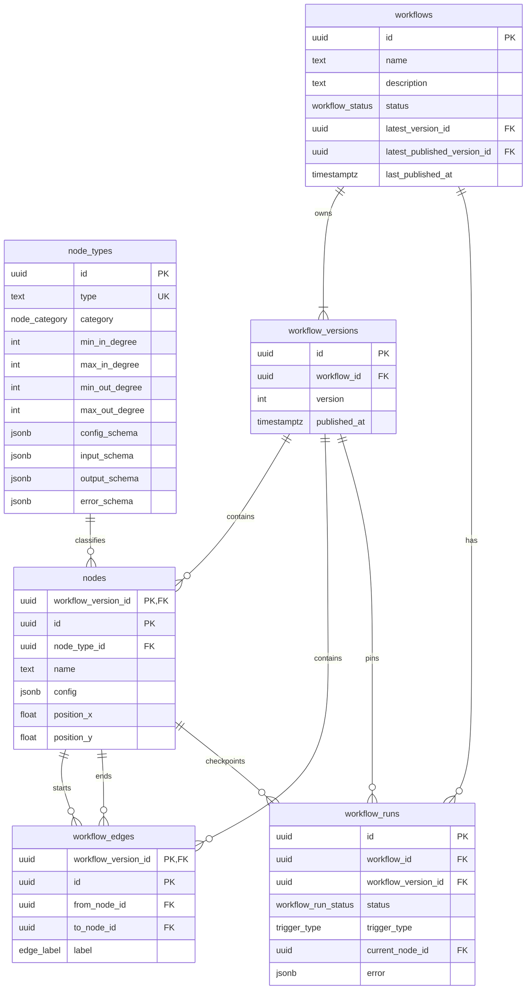

The diagram is a readable overview. In particular, version and node-name uniqueness are composite—`(workflow_id, version)` and `(workflow_version_id, name)`—rather than single-column constraints. Composite keys, partial indexes, timestamps, nullability, and implementation notes remain fully specified in [`schema.dbml`](./schema.dbml).

### `node_types`

**Interviewer:** Why have a node-type table instead of only an enum?

**Candidate:** This is the seeded catalog of executable node kinds. It stores behavior contracts and degree bounds, not just a name.

- UUID primary key and unique stable `type` slug;
- category: `trigger`, `logic`, `action`, or `terminal`;
- display name and min/max in/out degree;
- config, input, output, and error JSON Schemas;
- creation and update timestamps.

The catalog keeps node behavior extensible while `nodes` stays a generic graph table.

### `workflows`

**Interviewer:** What is the mutable object the user actually sees?

**Candidate:** `workflows` is that container.

- identity, name, optional description, and lifecycle status;
- `latest_version_id`, always present after atomic creation;
- nullable `latest_published_version_id`;
- created, updated, and last-published timestamps.

The two version foreign keys form a circular relationship with `workflow_versions`. Creation therefore uses deferred constraints or one transaction that inserts the workflow, inserts v1, and then sets the pointer.

Workflow names are not unique. Different workflows may reasonably share a human title.

### `workflow_versions`

**Interviewer:** Where do draft and published snapshots live?

**Candidate:** Each `workflow_versions` row is one complete graph snapshot.

- UUID identity and parent workflow;
- integer `version`, monotonic within that workflow;
- `published_at`, where `null` means draft;
- `created_at` and `last_updated_at` (this table uses `last_updated_at`, not `updated_at`).

`(workflow_id, version)` is unique. A partial unique index on `workflow_id WHERE published_at IS NULL` ensures at most one draft per workflow. Published rows are treated as immutable by the application.

### `nodes`

**Interviewer:** How can a client node ID remain stable across v1 and v2?

**Candidate:** A node ID is scoped by its version. Nodes use the composite primary key `(workflow_version_id, id)` and contain:

- client-generated logical ID;
- node type reference;
- unique name within the version;
- schema-validated JSON config;
- optional canvas coordinates;
- timestamps.

That is deliberate: `node_start` may exist in both v1 and v2 because it is the same logical builder node, while each row still belongs to exactly one graph snapshot.

### `workflow_edges`

**Interviewer:** Why keep edges in a separate table instead of self-relations on nodes?

**Candidate:** Separate rows make direction, labels, branching, and future routing behavior explicit.

- client-generated logical ID;
- owning workflow version;
- source and target node IDs;
- `default`, `true`, or `false` label;
- timestamps.

The primary key is `(workflow_version_id, id)`. Composite foreign keys from source and target to `nodes(workflow_version_id, id)` prevent cross-version edges. `(workflow_version_id, from_node_id, label)` is unique.

### `workflow_runs`

**Interviewer:** What is the minimum operational state needed for an execution?

**Candidate:** A run is one execution of one published version. It stores:

- workflow and pinned version IDs;
- state and trigger type;
- non-null `current_node_id` checkpoint;
- nullable structured error;
- timestamps for started, paused, cancelled, completed, and failed events;
- normal creation/update timestamps.

The checkpoint uses a composite foreign key with `workflow_version_id`, so a run cannot point into a different graph. Concurrent runs are valid and no uniqueness constraint attempts to prevent them.

We intentionally do not keep permanent node traces in this OLTP table. PostgreSQL answers “what is true about this active run now?” rather than “show every event this platform has ever produced.”

### Integrity now, performance indexes later

**Interviewer:** Should we add every index we might eventually need?

**Candidate:** Not yet. The v1 indexes encode known invariants:

- unique node-type slug;
- unique version number per workflow;
- at most one draft per workflow;
- unique node name per version;
- one outgoing edge for each source/label pair.

Listing, status, timestamp, foreign-key, and worker-polling indexes depend on real query patterns. They are deferred until those patterns exist rather than added speculatively.

## 6. Deep-Dive Design: Execution

This is the first deep dive: what exactly sits between "start a run" and "the run finished", and what happens when things break. The decisions here are drawn on the execution deep-dive section of the [`orchex.excalidraw`](./orchex.excalidraw) board.

### The picture first

**Interviewer:** Section 3 showed the execution service putting jobs into a queue and workers pulling them out. Is that still the whole story?

**Candidate:** Almost, but one important thing changed: **workers never talk to the queue directly anymore.** Everything a worker decides is written to Postgres, and a small process called the relay moves jobs from Postgres into the queue. Here is the full flow:

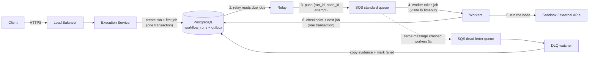

The happy path, in words:

1. The user starts a run. The execution service creates the run **and** its first job row in one Postgres transaction.
2. The relay picks up the job row and pushes a small message to the queue: just `{run_id, node_id, attempt}`.
3. A worker takes the message, reads the run and its pinned graph from Postgres, and executes the node.
4. The worker writes two things in one transaction: "the run is now at the next node" and "a job for that next node must be enqueued".
5. The relay pushes that next job. Steps 3–5 repeat, one node at a time.
6. When the Response node finishes, the worker marks the run `completed` and writes no next job. The loop simply stops.

The queue stays dumb on purpose. Messages carry identity only — never data, never state. If the queue lost every message tomorrow, Postgres would still know exactly where every run stands.

### Why a task queue and not an event log?

**Interviewer:** Systems at this scale often use an event log (a Kafka-style append-only stream). Why a task queue?

**Candidate:** Because our unit of work is a **job**, not a fact.

An event log is a history: "this happened, then this happened." Consumers read it in order, at their own pace, and can replay it from the beginning. That is perfect when many readers need the same ordered stream — analytics, audit, dashboards.

A task queue is a to-do list: "someone, do this once." Each message goes to exactly one worker, can be retried on its own, delayed on its own, and quarantined on its own if it is poisonous.

Node jobs are to-dos, and the differences bite quickly if you pick the wrong tool:

- **Independence.** Every job stands alone. In a log, messages behind a slow one in the same partition must wait; one stuck 300-second node would hold up unrelated runs.
- **Per-message retry.** We retry, delay, and dead-letter individual jobs. Logs track a single read position per consumer — skipping one bad message while keeping the rest is painful.
- **No replay wanted.** Replaying execution history would re-run side effects. Our source of truth for "where is this run?" is Postgres, not the message history.

The design needs only three properties from the queue: at-least-once delivery, a per-message lease, and a dead-letter queue. Anything offering those fits — the concrete product is chosen at the [end of this deep dive](#which-queue-product-do-we-actually-use). The event log idea is not wasted either — it returns later as the pipe into ClickHouse for observability, where an ordered replayable history is exactly right.

### One queue or six?

**Interviewer:** Six node types with very different speeds — milliseconds for a Conditional, up to 300 seconds for an API call. Separate queues per type?

**Candidate:** One shared queue for v1. The instinct to split comes from a fear: slow jobs clog the line and fast jobs starve behind them. But our slow nodes are slow because they **wait** — on someone else's API, on the sandbox — not because they compute. A worker waiting on an HTTP response can hold many other jobs at the same time, so slow jobs do not block fast ones in practice.

Splitting would mean routing rules in the execution service, in every worker, and in the relay — real complexity for a problem we have not measured. And the escape hatch stays cheap: messages already carry `node_id`, so adding a routing rule later changes no contracts.

### What is a lease, and which kind do we use?

**Interviewer:** A worker takes a job and dies halfway. How does the job survive?

**Candidate:** Through the queue's **lease**. When a worker takes a message, the message is not deleted — it becomes invisible for a while. If the worker finishes and says "done", it is deleted. If the worker never says "done", the message reappears and another worker gets it.

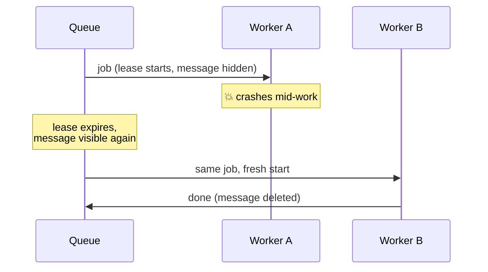

Different products name the same idea differently — SQS says _visibility timeout_, Google Pub/Sub says _ack deadline_, orchestration papers say _task lease_ — but it is one concept.

The catch: the lease must be **longer than the slowest legal node**, or the queue redelivers a job that is still running and the same API call fires twice. Three ways to size it:

1. **One flat value for everything** — say 360s. Simple, but a crashed 1-second Conditional job also waits 6 minutes to be rescued.
2. **Per message** — each node's config already declares its timeout, so we know each job's worst case before enqueueing it. Fast jobs get short leases and quick rescue; slow jobs get room to finish.
3. **Heartbeat** — start small and let the worker keep extending while alive. Works, but more machinery than v1 needs.

We chose **(2) per-message leases**, sized from the node's configured timeout plus a small buffer.

### The same job arrives twice. Now what?

**Interviewer:** Queues promise at-least-once delivery. So duplicates are guaranteed to happen eventually.

**Candidate:** Yes — a lease that expires a moment too early, a "done" signal lost on the network. We do not try to prevent duplicates; we make them harmless with two checks in the worker.

**Check 1 — before executing:** read the run from Postgres. If the run has already moved past this job's node and attempt, the job is stale. Drop it without executing anything.

**Check 2 — when saving progress:** the checkpoint write is conditional. Not "set the run to the next node" but "set the run to the next node **only if it is still at this one**":

```sql
UPDATE workflow_runs
SET current_node_id = 'node_response', current_node_attempt = 1
WHERE id = 'run_01'
  AND current_node_id = 'node_api'      -- the guard
  AND current_node_attempt = 1;
```

Postgres runs updates on the same row one at a time. If two workers race, the first update succeeds ("1 row changed") and that worker continues; the second finds the guard false ("0 rows changed") and quietly discards its job.

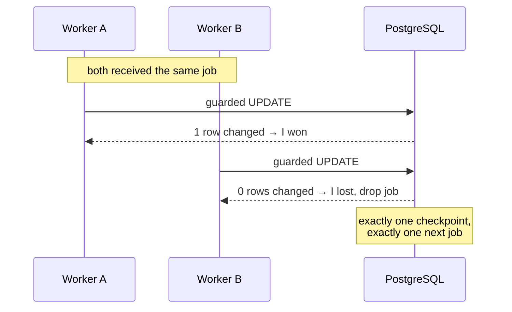

The residual risk we accept: in a tight race both workers may have already fired the external call, so a side effect can still happen twice. No orchestrator can fix that from its own side; it needs the external API to support idempotency keys, which we defer.

### The crash between two steps: the outbox

**Interviewer:** After running a node the worker must save the checkpoint in Postgres _and_ enqueue the next job in the queue. Two systems — what if it crashes between the two?

**Candidate:** Without protection, that crash freezes the run forever: the checkpoint says "at `node_response`" but no message for `node_response` exists anywhere, and the old message was already acked. The user sees a spinner that never ends.

Flipping the order does not help — enqueue first and crash before checkpointing, and the new job fails our own staleness check.

The fix is the **transactional outbox**. The worker never touches the queue. It writes the checkpoint _and_ a job row into the `run_node_jobs_outbox` table in **one transaction** — one commit, so both exist or neither does:

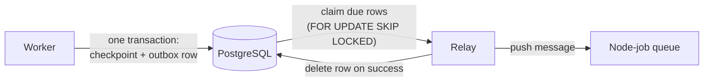

The relay loops every few hundred milliseconds: claim due rows, push them to the queue, delete them. `FOR UPDATE SKIP LOCKED` is Postgres for "lock the rows I claimed, and let other relay instances skip them instead of waiting" — so several relays can run at once with zero coordination.

Both relay crash cases are safe:

- Crash **before pushing** → the claim evaporates with the uncommitted transaction; the next pass picks the rows up again.
- Crash **after pushing, before deleting** → the rows get pushed a second time. Duplicate message — which the previous section already made harmless.

The outbox table is intentionally boring: rows are inserted once, read once, deleted. Never updated. A row's existence _is_ the state "this job still needs to reach the queue".

### Retrying failures automatically

**Interviewer:** A node fails with a transient error — the API returned 500. Does the user really have to press Retry by hand?

**Candidate:** No. But first, a distinction that keeps the whole design honest: there are **two separate failure worlds, and they never mix**.

**World 1 — the node's work failed, the worker is fine.** The API returned 500, the expression crashed, the token expired. The worker is alive to _report_ it through the structured error envelope, and this is the only world where `retryable` means anything.

**World 2 — the worker itself died.** Nobody reports anything. The lease, the outbox, and the guarded updates recover silently. No error envelope is ever written, and `retryable` never enters the picture.

Auto-retry lives purely in World 1:

- A retryable failure (500, timeout, rate limit) does not fail the run. The worker bumps the attempt counter and writes an outbox row with a **delay**: `available_at = now() + backoff`. The relay simply does not pick the row up before that time. The retry is a brand-new message, born through the same outbox as everything else.
- A non-retryable failure (bad config, HTTP 400, expired auth) fails the run immediately — retrying cannot help.
- The policy: **3 attempts total, waits of 10s then 40s, each with ±25% random jitter** so a thousand runs hitting the same dying API do not all come back in the same second. A rate-limited error that carries `retry_after_ms` gets whichever wait is longer.
- Between attempts the run stays `running`, with the transient error visible in `workflow_runs.error` so the UI can show "attempt 2 of 3, retrying at 10:31:07".
- Attempts exhausted → `failed`, error stored, human decides. Manual Retry resets the counter and mints a fresh job.

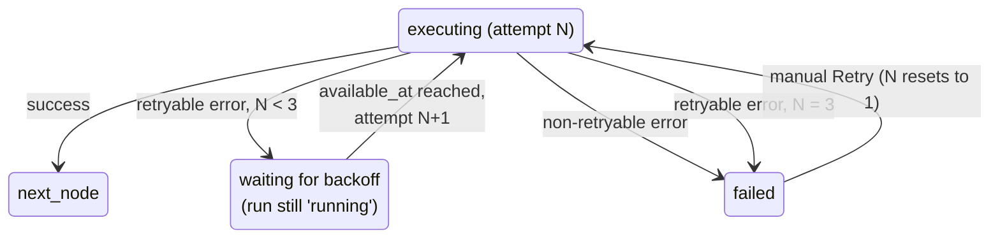

### Poison messages and the dead-letter queue

**Interviewer:** World 2 has a monster in it: a job that kills every worker that touches it. Out-of-memory on a huge payload, a crash bug. The lease "helpfully" resurrects it, and it kills again.

**Candidate:** That is a **poison message**, and the worker cannot defend itself — it is the one dying. The queue must give up on the job instead.

The queue counts deliveries per message. A healthy message is delivered once, maybe twice after an unlucky lease expiry. A poison message racks up deliveries because no worker ever lives long enough to ack it. **After 5 deliveries, the queue stops redelivering and parks the message in the dead-letter queue.** The killing stops.

(Auto-retries never inflate this counter — each retry is a brand-new message with a fresh count. The counter only climbs when the _same_ message keeps crashing workers.)

Parking the message solves only half the problem. The run is still `running`, and no message exists that will ever move it — the frozen-spinner problem through another door. So a small **DLQ watcher** does the one write the dead worker never could, with the same guard as always:

```sql
UPDATE workflow_runs
SET status = 'failed', failed_at = now(),
    error = '{"node_id": "...", "error": {"type": "internal", "code": "INTERNAL_ERROR",
              "message": "Execution failed repeatedly.", "retryable": false}}'
WHERE id = 'run_01'
  AND current_node_id = '...' AND current_node_attempt = 1
  AND status = 'running';
```

The user sees a failed run with a Retry button instead of an eternal spinner. Retry mints a fresh message; if the cause was a since-fixed bad deploy, the run continues, and if the job is truly poison it returns to the DLQ five crashes later.

Parked messages are kept for 14 days as evidence — when someone asks "what kept killing our workers?", the message with its `{run_id, node_id, attempt}` is the starting thread.

### One failure table to rule them all

**Interviewer:** Summarize: for every place this can break, what saves us?

**Candidate:**

| Failure                                       | What saves us                                                        |
| --------------------------------------------- | -------------------------------------------------------------------- |
| Worker crashes before executing               | Lease expires → redelivered → fresh worker. Invisible.               |
| Worker crashes mid-action                     | Same — but the external call may fire twice (accepted residual risk) |
| Worker crashes before checkpoint commits      | Transaction atomicity: no half-written state; redelivery re-runs     |
| Worker crashes between checkpoint and enqueue | **Impossible** — outbox made them one transaction                    |
| Worker crashes after commit, before ack       | Duplicate delivery → staleness check drops it, nothing executes      |
| Relay crashes before pushing                  | Claim evaporates; next pass retries                                  |
| Relay crashes after pushing, before deleting  | Duplicate message → guards absorb it                                 |
| Node reports a retryable error                | Auto-retry: 3 attempts, growing waits, then `failed`                 |
| Node reports a non-retryable error            | `failed` immediately, structured error stored                        |
| Job crashes every worker that touches it      | 5 deliveries → DLQ → watcher marks the run `failed`                  |

Each layer lets the one above it be sloppy. The lease may redeliver, the relay may double-push, workers may race — nothing corrupts, because the guarded checkpoint at the bottom decides every conflict.

### What this deep dive changed in the schema

**Interviewer:** All of this machinery must live somewhere. What did the schema gain?

**Candidate:** One new column, one new table, and one new index. Easiest to show with the run we have been using all along: Start → `node_api` → `node_response`, run `run_01`, pinned to version `ver_01`.

#### The new column: `workflow_runs.current_node_attempt`

The run already knew _where_ it is (`current_node_id`). Now it also knows _how many times it has tried to be there_. Watch the two columns move together through a bumpy run:

| What just happened                           | `current_node_id` | `current_node_attempt` |
| -------------------------------------------- | :---------------: | :--------------------: |
| Run created                                  |   `node_start`    |          `1`           |
| Start succeeds, checkpoint advances          |    `node_api`     | `1` (reset — new node) |
| API returns 500 → auto-retry scheduled       |    `node_api`     |          `2`           |
| API returns 500 again → last retry scheduled |    `node_api`     |          `3`           |
| Third try succeeds, checkpoint advances      |  `node_response`  |   `1` (reset again)    |

The counter is also part of every guarded update: a worker may only write "attempt 3 happened" if the run still says attempt 2. Two workers racing on the same retry cannot both win.

#### The new table: `run_node_jobs_outbox`

| Column                | Example value            | Meaning                                                       |
| --------------------- | ------------------------ | ------------------------------------------------------------- |
| `run_id`              | `run_01`                 | which run                                                     |
| `workflow_version_id` | `ver_01`                 | the run's pinned graph                                        |
| `node_id`             | `node_api`               | which node to execute                                         |
| `attempt`             | `2`                      | which try this is                                             |
| `available_at`        | `now() + 10s`, or `NULL` | `NULL` = push immediately; a time = retry waiting for backoff |

A row here means exactly one thing: _"a queue message for this job still needs to be sent."_ Follow `run_01` through the table:

1. Run starts → one transaction inserts the run **and** the row `(run_01, ver_01, node_start, 1, NULL)`.
2. The relay pushes that message and deletes the row. Table is empty again.
3. `node_start` succeeds → the worker's transaction inserts `(run_01, ver_01, node_api, 1, NULL)`. Pushed, deleted.
4. `node_api` fails with a 500 → the worker inserts `(run_01, ver_01, node_api, 2, now() + 10s)`. This row **sits visibly in the table for 10 seconds** — the relay skips rows that are not due yet. `SELECT * FROM run_node_jobs_outbox` literally _is_ the pending-retries dashboard.
5. Ten seconds pass, the relay pushes it, deletes it, and attempt 2 runs.

Rows are inserted once, read once, deleted — never updated. All state that changes over time lives on `workflow_runs`.

#### The new index, and why the FKs are composite

The outbox row above names both a run **and** a version. What stops a buggy insert from pairing them wrongly — say `(run_01, ver_02, ...)`, a version this run never pinned? Two composite foreign keys, chained:

- `(run_id, workflow_version_id)` must match `workflow_runs (id, workflow_version_id)` — _the version must be the run's pinned version._ For Postgres to accept a foreign key onto that column pair, the pair must be unique on the target table — that is the entire reason the new unique index `workflow_runs (id, workflow_version_id)` exists.
- `(workflow_version_id, node_id)` must match `nodes (workflow_version_id, id)` — _the node must exist in that version's graph._

Chain them together and an outbox row physically cannot point at the wrong graph: run → its pinned version → a node of that version. It is the same protection `current_node_id` already had, extended to the job pipeline.

#### The whole schema, after this deep dive

**Interviewer:** Put it all together — what does the database look like now?

**Candidate:** The six baseline tables from section 5, plus the outbox and the retry counter. Additions from this deep dive are marked `NEW`:

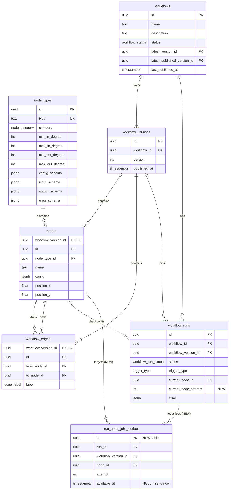

Summary of every change this deep dive made, in one place:

| Change                                                                     | Kind                    | Why it exists                                                                       |
| -------------------------------------------------------------------------- | ----------------------- | ----------------------------------------------------------------------------------- |
| `workflow_runs.current_node_attempt`                                       | new column              | how many times the current node has been tried; reset on advance and manual Retry   |
| `run_node_jobs_outbox`                                                     | new table               | jobs written atomically with checkpoints; the relay drains it into the queue        |
| `run_node_jobs_outbox.available_at`                                        | column on the new table | the entire retry-delay mechanism — one nullable timestamp the relay filters on      |
| `uq_workflow_runs_id_version` on `workflow_runs (id, workflow_version_id)` | new unique index        | the target a composite FK needs so outbox rows must use the run's pinned version    |
| Outbox composite FKs → `workflow_runs`, `nodes`                            | new constraints         | a job row can never mix a run with the wrong version or a node from the wrong graph |

As before, [`schema.dbml`](./schema.dbml) is the fully specified version — timestamps, nullability, and the exact index definitions live there.

### Which queue product do we actually use?

> [!IMPORTANT]
> This decision is also drawn on the [`orchex.excalidraw`](./orchex.excalidraw) board — the options, tradeoffs, and the final SQS mapping in picture form.

**Interviewer:** The design so far says "any queue with at-least-once delivery, a lease, and a DLQ fits." Time to name one. What are the options?

**Candidate:** First, the honest shopping list. Because delay, retry scheduling, and ordering already live in Postgres, the queue must provide only four things:

1. at-least-once delivery — never silently drop a message;
2. a lease — message hidden while a worker holds it, back if the worker dies;
3. delivery counting with a DLQ — park a message after 5 deliveries, keep it 14 days;
4. high availability — no single point of failure.

And it must **not** be asked to provide delays, retries, ordering, replay, or data transport. Messages are tiny identity envelopes at roughly 60–120 messages/second even at 1M runs/day, so throughput does not decide this. Lease mechanics, DLQ support, the HA story, and who operates it decide this.

**Interviewer:** So walk the candidates.

**Candidate:**

| Option                                | Lease model                         | DLQ built in         |                  No SPOF                   | Who operates it                                |
| ------------------------------------- | ----------------------------------- | -------------------- | :----------------------------------------: | ---------------------------------------------- |
| Postgres as the queue (`SKIP LOCKED`) | DIY column                          | DIY table            |            tied to PG's own HA             | us (it is our DB)                              |
| **AWS SQS (standard)**                | **per-message timer**               | yes (redrive policy) |                yes, managed                | nobody                                         |
| Google Pub/Sub                        | deadline + auto-extend              | yes                  |                yes, managed                | nobody                                         |
| Azure Service Bus                     | 5-min lock + renew                  | yes (best-in-class)  |                yes, managed                | nobody                                         |
| RabbitMQ (quorum queues)              | connection-based, per-queue timeout | yes (delivery limit) |      yes, with a 3-node Raft cluster       | us                                             |
| Redis + BullMQ                        | lock + stalled checker              | partial              | no — async replication can lose acked jobs | us                                             |
| NATS JetStream                        | per-consumer AckWait                | **no — DIY**         |         yes, with a 3-node cluster         | us                                             |
| Kafka                                 | —                                   | —                    |                     —                      | already ruled out: event log, not a task queue |

The one-line verdicts:

- **Postgres-as-queue** works at our scale, but we would hand-build lease expiry, delivery counting, and the DLQ, and our database and queue would fail together.
- **Pub/Sub** and **Service Bus** both push us toward heartbeat-style lease renewal, which we already rejected as more machinery than v1 needs. Service Bus's 5-minute lock is exactly our 300s worst case with zero buffer.
- **RabbitMQ** has no timed per-message lease at all — redelivery happens when the worker's _connection_ dies, not when a timer expires. Choosing it would force us to revise the per-message lease decision, and we would operate the cluster.
- **Redis/BullMQ** duplicates machinery we already rebuilt in Postgres (delays, retries), and async replication means a failover can lose acknowledged jobs — the one thing this design cannot tolerate.
- **NATS JetStream** would make us hand-roll the DLQ, one of our four hard requirements.
- **SQS** is the only option where "per-message lease sized from the node's timeout" — a decision we locked before naming a product — works natively.

**The decision: AWS SQS, standard queue.** The locked design maps onto it almost word for word:

| Our locked decision              | SQS feature                                                                                        |
| -------------------------------- | -------------------------------------------------------------------------------------------------- |
| At-least-once delivery           | standard queue default guarantee                                                                   |
| Per-message lease                | visibility timeout                                                                                 |
| 5 deliveries then DLQ            | redrive policy, `maxReceiveCount: 5`                                                               |
| Parked messages kept 14 days     | DLQ retention set to 14 days (SQS's maximum)                                                       |
| Delay and retry live in Postgres | `DelaySeconds` simply unused — the outbox owns time                                                |
| No ordering needed               | standard queue, not FIFO — FIFO would add ordering coupling and throughput ceilings we do not want |
| Messages survive broker failure  | SQS stores messages redundantly across availability zones                                          |

Occasional duplicate deliveries from a standard queue land on the guarded checkpoint updates, which were built for exactly that. Workers receive with long polling (`WaitTimeSeconds: 20`), and batching send/receive/delete up to 10 messages keeps the bill to a few dollars a day at 10M node executions/day.

### How the lease is actually sized on SQS

**Interviewer:** The lease decision said "per message, sized from the node's configured timeout, at enqueue time." Does SQS support that?

**Candidate:** Almost — with one mechanical shift. SQS cannot set visibility per message at _send_ time; visibility is controlled at _receive_ time. So the sizing moves from the relay to the worker:

1. the queue's default visibility timeout stays short — say 60 seconds;
2. the worker receives a message and looks at the node it is about to run;
3. if that node's configured timeout is long, the worker calls `ChangeMessageVisibility` to extend the lease to timeout-plus-buffer _before_ starting work.

Same outcome — fast jobs get quick rescue, slow jobs get room — sized by the worker at pickup instead of by the relay at enqueue. One extra API call, only for slow nodes. A mechanics amendment, not a decision reversal.

### Is the queue a single point of failure?

**Interviewer:** We demanded "no SPOF." But the lease already survives worker deaths — do we truly need a highly available queue?

**Candidate:** Worker failure and queue failure are different things, and the design tolerates them differently:

- **Queue unreachable:** the relay cannot push — outbox rows simply sit and buffer; workers cannot receive — runs stall and users see spinners. The moment the queue returns, everything drains and continues. Ugly, but self-healing.
- **Queue loses an accepted message:** poisonous. The outbox row was already deleted after the push. The run says `running`, no message exists anywhere, and the DLQ watcher never sees it because nothing was dead-lettered — it vanished. That run is frozen forever.

So the property we actually need is less "always answers" and more "never forgets": **durability of accepted messages**. SQS gives both — multi-AZ replication makes the frozen-run trap structurally impossible — which is why the availability question dissolved once the product was chosen.

One gap stays on the books: a **stalled-run sweeper** — a periodic job that finds runs stuck in `running` with no pending outbox row and no plausible in-flight lease, and re-mints the job from `current_node_id` + `current_node_attempt`. It is the only mechanism that would make "Postgres knows where every run stands" _actionable_, and it would also catch a message silently expiring after 14 days in the main queue. **Deferred, deliberately:** SQS's durability removes the scary version of the failure, and v1 stays small. It is recorded in [the deferred list](#8-deep-dives-still-to-come), not forgotten.

### What the DLQ watcher does with the evidence

**Interviewer:** The DLQ keeps parked messages for 14 days as evidence, and the watcher reads them to mark runs failed. Can it do both?

**Candidate:** Not naively — an SQS DLQ is just a regular queue, and a regular queue cannot be a to-do list and a filing cabinet at the same time. Delete the message after processing and the evidence vanishes; leave it and it reappears every visibility expiry, making the watcher re-process old news for 14 days.

The resolution: let the DLQ be the to-do list and let Postgres be the filing cabinet. The watcher

1. reads the parked message,
2. copies `{run_id, node_id, attempt}` into the run's `error` details in Postgres — where anyone debugging looks first anyway,
3. marks the run `failed` with the same guarded update as always,
4. deletes the message.

The evidence now lives forever, attached to the exact failed run, and the queue stays clean.

### The DLQ is never a work list

**Interviewer:** Someday we may want automatic recovery instead of a human pressing Retry. Isn't the DLQ exactly the backlog we would process?

**Candidate:** No — and the two failure worlds explain why. Retryable _node_ errors (500s, timeouts) already retry automatically through the outbox and never reach the DLQ. A DLQ message is a job with a proven record of _crashing five workers in a row_. Feeding it back automatically just crashes five more — an infinite worker-slaughter loop. The DLQ's entire purpose is to be where retrying **stops**.

The legitimate futures both respect that:

- **Ops redrive:** a bad deploy crashed workers, the fix shipped, 200 parked messages are innocent — a _human_ triggers SQS's DLQ redrive to move them back. After-the-fix, not automatic.
- **Auto-recovery policy:** the DLQ watcher could someday schedule one delayed extra attempt instead of marking the run failed — by writing an **outbox row**, the same birth canal as every other job.

The locked rule: **the DLQ is a quarantine and an evidence bag, never a work list. Jobs are born in exactly one place — the outbox.** Anything resurrecting a run — Retry button, ops redrive, future policy — mints a fresh job through Postgres, never by re-consuming the corpse. One birthplace is also what keeps attempt counters and guards trustworthy.

### Why the relay still polls

**Interviewer:** The relay queries Postgres every few hundred milliseconds, mostly finding nothing. Wasteful?

**Candidate:** Less than it looks — an indexed query on a near-empty table costs microseconds; the real cost is up to one poll interval of added latency per hop. Two upgrades exist when we care:

- **`LISTEN`/`NOTIFY`:** Postgres's built-in doorbell. A trigger on the outbox notifies on commit; the relay sleeps until rung. Near-zero latency — but a doorbell, not a mailbox: signals fired while the relay is down are gone, so a slow safety-net poll must stay. And delayed retry rows need a clock regardless — nothing rings when `available_at` comes due.
- **CDC / logical decoding (Debezium-style):** subscribe to the WAL itself; durable and push-based, but it swaps a 30-line loop for replication slots to babysit and real infrastructure. Its natural moment is the ClickHouse pipeline later, not this relay.

**Decision: poll-only for v1.** The hybrid (NOTIFY fast path + slow poll backstop) is a pure optimization that changes no contracts, so it can be bolted on the day latency matters.

## 7. Deep-Dive Design: OLTP Database

> [!IMPORTANT]
> This decision is also drawn on the [`orchex.excalidraw`](./orchex.excalidraw) board — look for **Orchex — OLTP Database Decision** (to the right of the Queue Decision board): requirements, market cards, RDS pick, flow, and capacity check.

This deep dive names the OLTP product. Section 5 already locked **relational PostgreSQL** for integrity. Here we answer: why not NoSQL, why not every other SQL product on the market, and why **Amazon RDS for PostgreSQL** over Aurora or a distributed database.

Assumptions carried in from scale and execution:

- write-heavy execution path (checkpoint + outbox every hop);
- ~10 new runs/s steady, ~100/s peak;
- ~10 hops per run → about **100 / 1000 hop transactions per second**;
- capacity conversation includes ~60k concurrent runs when workflows run longer than a minute;
- queue is already **AWS SQS**, so v1 lives on AWS;
- v1 is **one region** (one writer). Multi-region active writes are out of scope for now.

### Why a relational database at all?

**Interviewer:** Execution is write-heavy and we added an outbox, which means even more writes. Why not DynamoDB or Mongo and keep life simple?

**Candidate:** The outbox does not remove the need for a database that can reject bad data. Two things must be true in the same commit: the run checkpoint advances, and the next job row exists. Different systems (Postgres and SQS) cannot share one commit, so we write checkpoint + outbox together, and the relay pushes to SQS later. Delay is fine; loss is not.

NoSQL can do multi-item transactions. What we refuse to demote to application hope is:

1. **Same-version integrity** — edges, checkpoints, and outbox rows must point at nodes of the run’s pinned version. Cross-version junk must be impossible.
2. **Uniqueness the database enforces** — e.g. at most one draft per workflow, unique node names per version, one edge label per source.

Those are composite foreign keys and unique / partial-unique rules. On a document store we would reimplement them in every writer. For Orchex, the database is the last line of defense.

### What we need from the OLTP product

**Interviewer:** In plain words, what must the product give us?

**Candidate:**

1. Real SQL transactions (checkpoint + outbox in one go).
2. Foreign keys and unique rules as designed in [`schema.dbml`](./schema.dbml).
3. A change stream later (CDC / Debezium) so we can replace the poll relay without rewriting the app.
4. Enough write speed for ~1000 hop TPS at peak, with headroom.
5. Managed operations on AWS at a cost we can live with in v1.

### Walk the market (simple language)

**Interviewer:** Walk the options like you are explaining them to someone who does not live in database internals.

**Candidate:**

| Option                                    | What it is, in one breath                                         | Pros for Orchex                                                                                       | Cons / why it loses                                                                                                           |
| ----------------------------------------- | ----------------------------------------------------------------- | ----------------------------------------------------------------------------------------------------- | ----------------------------------------------------------------------------------------------------------------------------- |
| **Amazon RDS for PostgreSQL**             | Normal Postgres, AWS runs backups, patching, and failover for you | Exact schema fit; Debezium-ready; cheaper than Aurora; matches SQS/AWS home; proven enough at our TPS | One writer (fine for v1); you still choose instance size                                                                      |
| **Amazon Aurora PostgreSQL**              | Postgres for the app, special AWS storage under the hood          | Faster failover, storage grows itself, nice HA story                                                  | Costs more; we do not need that comfort yet after capacity tests                                                              |
| **Self-managed Postgres**                 | You install Postgres on machines yourself                         | Full control, no RDS fee                                                                              | We become the DBA team — wrong trade for v1                                                                                   |
| **AlloyDB (GCP)**                         | Google’s managed Postgres-compatible DB                           | Strong managed Postgres on GCP                                                                        | Wrong cloud while the queue is SQS                                                                                            |
| **MySQL / Aurora MySQL / MariaDB**        | Another popular relational database                               | Solid OLTP, CDC exists                                                                                | Our schema is Postgres-shaped (partial unique “one draft”, composite FKs, JSONB habits). Switching means redesign for no gain |
| **CockroachDB / YugabyteDB**              | SQL that automatically splits across many machines                | Horizontal writes, multi-region survival                                                              | Overkill for one-region ~1000 TPS; more latency/complexity/license than we need                                               |
| **TiDB**                                  | Distributed SQL that speaks MySQL                                 | Huge scale, optional analytics engine                                                                 | MySQL dialect + distributed model fights our design                                                                           |
| **Google Spanner**                        | Google’s global relational database                               | Extreme global consistency                                                                            | Different API, high cost, global features we are not buying in v1                                                             |
| **Citus / Vitess (sharding)**             | Split one logical DB into many shards                             | Scale writes by cutting the data                                                                      | Cross-shard foreign keys get weak or die — exactly the integrity we refused to drop                                           |
| **Neon / Supabase (serverless Postgres)** | Real Postgres, great for branching and early product              | Nice for previews/dev                                                                                 | Not the bet for a busy production execution spine                                                                             |
| **Oracle / SQL Server**                   | Big enterprise databases                                          | Mature and powerful                                                                                   | License and culture mismatch; Postgres already covers the need                                                                |
| **DynamoDB / Mongo / “just JSON”**        | Document or key-value stores                                      | Easy horizontal stories for some apps                                                                 | No native composite FK / partial-unique story for our graph/run/outbox rules                                                  |

### Why RDS PostgreSQL wins

**Interviewer:** So compress that into the decision.

**Candidate:**

1. **Relational Postgres is mandatory** for the integrity rules above — not optional polish.
2. **AWS is home** because SQS is already the queue; AlloyDB/Spanner pull us into another cloud for no reason.
3. **Distributed SQL and sharding are premature** — our peak write shape is hundreds to low thousands of small transactions per second, not “one machine cannot keep up.”
4. **Aurora is a luxury, not a requirement** — better failover and storage automation, higher bill. We would revisit if HA/ops pain shows up.
5. **RDS is the cost/simplicity default** that still speaks full PostgreSQL, including the path to CDC later.

**The decision: Amazon RDS for PostgreSQL.** One region, one writer, managed by AWS.

### Did we check the size is enough?

**Interviewer:** Fine philosophy. Can a small RDS actually take the write load?

**Candidate:** We load-tested the real schema with an Orchex-shaped mix (checkpoint update + outbox insert + relay-style delete) under Docker CPU/RAM caps. Full notes live in [`bench/postgres/results/`](./bench/postgres/results/).

Plain results for **10 hops/run** (so steady ≈ 100 hop TPS, peak ≈ 1000 hop TPS):

| Box (Docker caps) | Steady ~100 hop TPS | Peak ~1000 hop TPS                                                                         |
| ----------------- | ------------------- | ------------------------------------------------------------------------------------------ |
| 2 vCPU / 4 GB     | Pass                | Pass (comfortable)                                                                         |
| 1 vCPU / 2 GB     | Pass                | Pass only if DB client concurrency stays low; fails when too many clients fight the outbox |

**Planning default: an RDS instance in the 2 vCPU / 4 GB class** for peak comfort. 1 vCPU / 2 GB is a possible cost floor for steady traffic, not the safe peak default. These are capacity _signals_, not a promise that a specific RDS class equals Docker — but they show the SQL mix is nowhere near needing Aurora Limitless or Cockroach on day one.

Memory was not the story: the active run table stayed small (tens of MB at 60k seeded runs). CPU and lock contention under too many clients were.

### What we are explicitly not deciding here

**Interviewer:** What stays open?

**Candidate:** Exact RDS instance class and Multi-AZ vs Single-AZ purchase options; parameter-group tuning (`shared_buffers`, connection pooling with RDS Proxy / PgBouncer); when to move the relay from poll to Debezium; any multi-region active-active topology. Those are operations follow-ups, not a reopen of “which database family.”

## 8. Deep-Dive Design: Graph Data Structure

> This decision is also drawn on the [`orchex.excalidraw`](./orchex.excalidraw) board — adjacency, degrees, DAG vs cycle, Kahn peel, and the Orchex mapping in picture form. The Go sketches in [`data-structure`](./data-structure) are the practice notes behind these ideas.

### What do we actually store?

**Interviewer:** A workflow is a graph. What data structure do we use for it?

**Candidate:** A **directed adjacency list** — plain language: for every step, remember the set of steps that may run next.

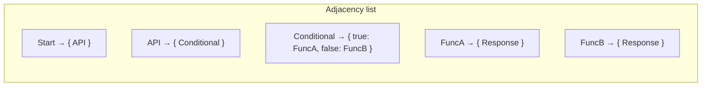

Think of it as a phone book of “who comes after whom,” not a big matrix of every possible pair. Looking up the next steps for one node is cheap. Storage grows with the number of nodes plus the number of wires — not with “every node times every node.”

We keep edges **directed**. `A → B` means B may run after A. The reverse is a different wire. That matches execution: work flows forward, not both ways.

| Idea           | Simple meaning        | Orchex use                 |
| -------------- | --------------------- | -------------------------- |
| Node           | A step on the canvas  | Start, API, Conditional, … |
| Directed edge  | A one-way wire        | “run this after that”      |
| Adjacency list | Per-node “next steps” | Fast “what runs next?”     |

### How do in-degree and out-degree guide the builder?

**Interviewer:** What do “in” and “out” mean for a node?

**Candidate:** **Out-degree** is how many wires leave a node. **In-degree** is how many wires enter it.

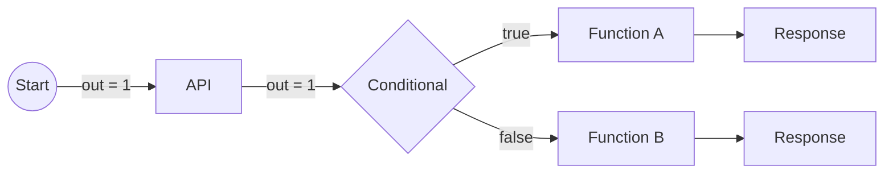

| Role on the canvas               | Degrees         | Everyday reading                                    |
| -------------------------------- | --------------- | --------------------------------------------------- |
| **Start**                        | in `0`, out `1` | Nothing before it; exactly one first step           |
| **API / Function / Integration** | in `1`, out `1` | One predecessor, one successor — a straight link    |
| **Conditional**                  | in `1`, out `2` | One way in; two labeled ways out (`true` / `false`) |
| **Response**                     | in `1`, out `0` | One way in; nothing after — the run finishes        |

Those rules are why v1 has **no merge**: two branches may not rejoin into one node (`in > 1`). Fan-in would need an explicit Join later; for now each branch keeps its own path.

### Why must a published graph be a DAG?

**Interviewer:** What breaks if someone wires a loop?

**Candidate:** A **DAG** is a directed graph with **no cycles**. Publish requires that shape so execution can always make progress and so a topological order exists.

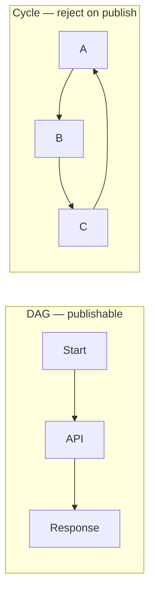

| Without a DAG                                          | With a DAG                          |
| ------------------------------------------------------ | ----------------------------------- |
| Scheduler can chase the same steps forever             | Every run has a finite path         |
| No safe “run A before B” list for the whole graph      | A topological order always exists   |
| Retry and checkpoint semantics grow into loop features | Checkpoint → next node stays simple |

Drafts may be messy while someone is drawing. **Publish** is where we insist: non-empty, acyclic, and degree rules satisfied.

### How do we detect a cycle without drowning in theory?

**Interviewer:** How do we know there is a loop?

**Candidate:** Prefer **Kahn’s peel** — it matches how a scheduler thinks.

1. Count unfinished dependencies for every node (that count is the in-degree).
2. Put every node with **zero** unfinished dependencies in a ready queue (Start is always ready first).
3. “Run” one ready node: remove it, and for each neighbor subtract one dependency.
4. When a neighbor hits zero, it becomes ready.
5. Repeat until nothing is ready.

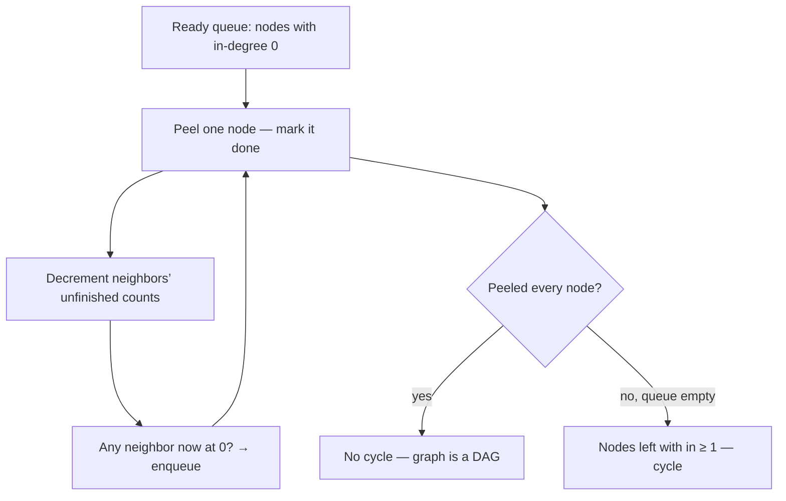

If you peel **every** node, there was no cycle. If the queue empties while nodes remain, every leftover node is waiting on another leftover node — mutual blocking — a **cycle**.

Depth-first “three-color” walking can also find cycles (you walk into a step you have not finished yet). Either answer is fine for publish validation. Kahn is the natural fit because the peel order is already a schedule.

### How does that become an execution order?

**Interviewer:** Once we know it is a DAG, how do we decide what can run when?

**Candidate:** A **topological order** lists every node so that for each wire `A → B`, A appears before B. That is one valid execution schedule.

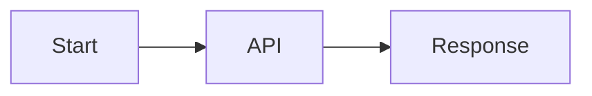

One topological order: `Start → API → Response`.

Kahn’s peel **is** that schedule: each time you peel a ready node, append it to the order. Branches can allow more than one valid order; v1 still keeps each path independent (no join), so the worker simply follows the chosen next edge after each node — Conditional picks `true` or `false`, everything else has a single successor.

### Structure vs meaning — two layers

**Interviewer:** Is the adjacency list enough by itself?

**Candidate:** No. We keep two layers in sync:

| Layer         | Holds                                         | Answers                                                 |
| ------------- | --------------------------------------------- | ------------------------------------------------------- |
| **Structure** | Nodes and directed edges (the adjacency list) | What is wired to what? Degrees? Cycles? Order?          |
| **Meaning**   | Node type and config (Start, API, …)          | What does this step _do_, and which degree rules apply? |

Validation walks both: every wired node must have a type, every type must satisfy its in/out rules, and the whole graph must be a DAG. The builder canvas positions are layout only — they do not change execution.

### What we lock for v1

**Interviewer:** What is settled for the graph structure itself?

**Candidate:**

1. **Directed adjacency list** as the working representation for validation and “what’s next.”
2. **Typed degree rules** per node type (table above).
3. **Publish requires a DAG**; drafts may be incomplete.
4. **Kahn-style peel** as the preferred way to detect cycles and to produce an execution order.
5. **No fan-in / join** in v1 — branches do not rejoin.

Postgres still owns durable truth (versioned `nodes` / `edges` rows). The adjacency list is how we _think and check_ the graph; the relational schema is how we _store_ it safely across versions and runs.

## 9. Deep-Dive Design: Control Plane Compute

> [!IMPORTANT]
> Where Orchex's long-running services run and how they scale. SQS and RDS are already on AWS, so compute stays there. Function-node sandboxing is a separate deep dive. Board: [`orchex-control-plane-compute.excalidraw`](./orchex-control-plane-compute.excalidraw).

**Interviewer:** Builder, Execution, relay, DLQ watcher, and workers all need to run somewhere and scale independently. What are the options?

**Candidate:** Two layers — **orchestrator** (keep N replicas healthy) and **capacity** (where CPU/RAM come from):

| Orchestrator                             | Capacity                                                  |
| ---------------------------------------- | --------------------------------------------------------- |
| **ECS** — AWS-native container scheduler | **Fargate** (serverless tasks) or **EC2** (our instances) |
| **EKS** — managed Kubernetes             | **Fargate** or **EC2**                                    |

```text
Client → ALB → Builder / Execution → RDS
                      │
                      └─ relay → SQS → Workers
```

APIs scale on ALB load; workers on SQS backlog; relay/DLQ watcher stay at a small fixed replica count. ~60k concurrent runs ≠ 60k tasks — workers are I/O-bound and one replica can hold many in-flight jobs.

### The four options

|          | ECS + Fargate                                                                                           | ECS + EC2                                                                              | EKS + Fargate                                                              | EKS + EC2                                            |
| -------- | ------------------------------------------------------------------------------------------------------- | -------------------------------------------------------------------------------------- | -------------------------------------------------------------------------- | ---------------------------------------------------- |
| **What** | ECS schedules tasks; Fargate provisions CPU/RAM per task                                                | ECS places tasks on an EC2 autoscaling group we operate                                | Same serverless capacity, Kubernetes control plane                         | Full K8s on node groups                              |
| **Pros** | No host management; lowest ops; native ALB + SQS autoscaling; fastest to ship                           | Better $/vCPU when the worker fleet is large and steady; same ECS task defs as Fargate | No hosts; K8s portability / ecosystem                                      | Max control, packing, Spot                           |
| **Cons** | Less machine-level control; cold starts if warm floor is too low; higher unit cost at huge steady scale | We own patching, bin-packing, and a second scaling loop (tasks + ASG)                  | K8s learning curve; EKS control-plane fee; more moving parts than v1 needs | Highest ops burden; slowest path to a minimal Orchex |

### Decision: ECS on Fargate

**Interviewer:** Lock it.

**Candidate:**

1. **No host management in v1** — Fargate, not EC2.
2. **ECS over EKS** — we do not need Kubernetes yet.
3. **EC2 under ECS** remains a later cost escape hatch (same services, different capacity).
4. **EKS** only if the org already mandates Kubernetes.

**The decision: Amazon ECS on Fargate** for Builder, Execution, relay, DLQ watcher, and workers — same region as RDS and SQS.

## 10. Deep Dives Still To Come

**Interviewer:** Is everything settled now?

**Candidate:** No. The execution spine, the queue product, the OLTP database product, the graph data-structure model, and the control-plane compute product (ECS on Fargate) are settled; these are next:

- durable run context and node-output propagation (how a node's output reaches the next node);
- pause/stop races and long-running node interruption;
- ClickHouse event, trace, retention, and correlation schemas;
- executor isolation, timeouts, resource limits, and sandbox adapters;
- authorization, tenancy, quotas, and data isolation;
- production query patterns and performance indexes.

**Interviewer:** Which product and API decisions are intentionally deferred?

**Candidate:** Keeping v1 small is part of the design:

- webhook and scheduler trigger APIs;
- Agent, Router, and Scheduler nodes;
- custom user-defined node types;
- multitenancy fields and authorization rules;
- arbitrary historical-version retrieval;
- list pagination and filtering;
- run input and a durable intermediate-context model;
- start-run idempotency keys;
- a standard HTTP error response body;
- one consistent archived-resource status (`404` or `410`);
- exact `id_remaps[]` element shape;
- reachability / exactly-one-Start as hard publish rules;
- narrowing General API `output_schema.status` to 2xx if we want the schema itself to forbid non-2xx success shapes;
- external idempotency keys, so a tight duplicate race cannot fire the same side effect twice;
- pause/stop races for long-running nodes;
- ClickHouse event and trace schemas;
- performance indexes based on production queries;
- transactional rollback;
- stalled-run sweeper (re-mint a job from Postgres when a message vanishes or expires) — deferred because SQS durability removes the scary case;
- relay `LISTEN`/`NOTIFY` hybrid — pure latency optimization, no contract change.

These are not hidden assumptions. They are the next decisions the design needs.

## Repository Map

**Interviewer:** Where can I inspect the source material behind these decisions?

**Candidate:**

- [`orchex.excalidraw`](./orchex.excalidraw) — authoritative architecture, API, schema, execution deep-dive, queue-product, OLTP/RDS, and graph data-structure board.
- [`orchex-control-plane-compute.excalidraw`](./orchex-control-plane-compute.excalidraw) — control-plane compute decision (ECS on Fargate).
- [`schema.dbml`](./schema.dbml) — PostgreSQL OLTP schema.
- [`bench/postgres`](./bench/postgres) — Docker + pgbench harness and capacity notes behind the RDS decision.
- [`node-type-schemas`](./node-type-schemas) — JSON Schema contracts for all six node types.
- [`data-structure`](./data-structure) — Go graph sketches and learning notes behind the graph data-structure deep dive.

The design has one recurring principle: let drafts be easy to build, make published workflows safe to run, and never lose the exact point from which a failed run should continue.
